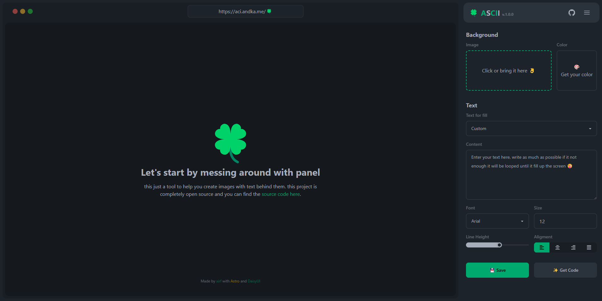

# ASCII

> Simple app to make image behind the text,

     

## 🍀 Preview

Check out the [live demo](https://aci.andka.me)!, got error? you got backup at [aci.andka.my.id](https://aci.andka.my.id) or straight to [vercel](https://ascii-image-kg9w.vercel.app).

> Want to deploy your own? here is the button

[](https://vercel.com/new/clone?repository-url=https%3A%2F%2Fgithub.com%2Fxirf%2Fascii-image&env=API_KEY&envDescription=API_KEY%20from%20pixabay%20to%20fetch%20the%20image%20from%20pixabay&envLink=https%3A%2F%2Fpixabay.com%2Fapi%2Fdocs%2F&project-name=ascii-image&repo-name=ascii-image&demo-title=ASCII%20Image&demo-description=Simple%20app%20to%20make%20image%20behind%20the%20text%2C&demo-url=https%3A%2F%2Faci.andka.me&demo-image=https%3A%2F%2Fraw.githubusercontent.com%2Fxirf%2Fascii-image%2Fmaster%2Fpublic%2Fscreenshot.png)

## ✨ Features
- Pure Astro without any framework 
- Instant preview
- Download the result 
- History without login
- Delete project that you don't need

## 🚀 Getting Started

Clone this repo locally and fill the ENV

this app using [Supabase](https://supabase.com) as database, you can grab the APIKey and `service_roles` [here](https://supabase.com/dashboard)

| Command           | Action                                       |
| :---------------- | :------------------------------------------- |
| `npm install`     | Installs dependencies                        |
| `npm run dev`     | Starts local dev server at `localhost:4321`  |
| `npm run build`   | Build your production site to `./vercel/`    |

> ⚠️ Note: This app is vercel as target deployment, if you want to deploy to other platform, you can change the astro integration.
>
> Because this app using api for database transaction, you need to enable SSR (server side rendering)building in `static` will not work. 

## 🐛 Bug and Issues

If you've found an issue or a bug, you can report it in the issues section of this repository. Please try to follow these simple guidelines to report your issue:

- Issue definition
- Expected behaviour
- Actual behaviour
- steps to reproduce
- Already tried fixes (if relevant)
  
## 🤝 Contributing

Contributions, issues and feature requests are welcome! feel free to check [issues page](https://github.com/xirf/ascii-image/issues) or add a new cool feature by [pull request](https://github.com/xirf/ascii-image/pulls).